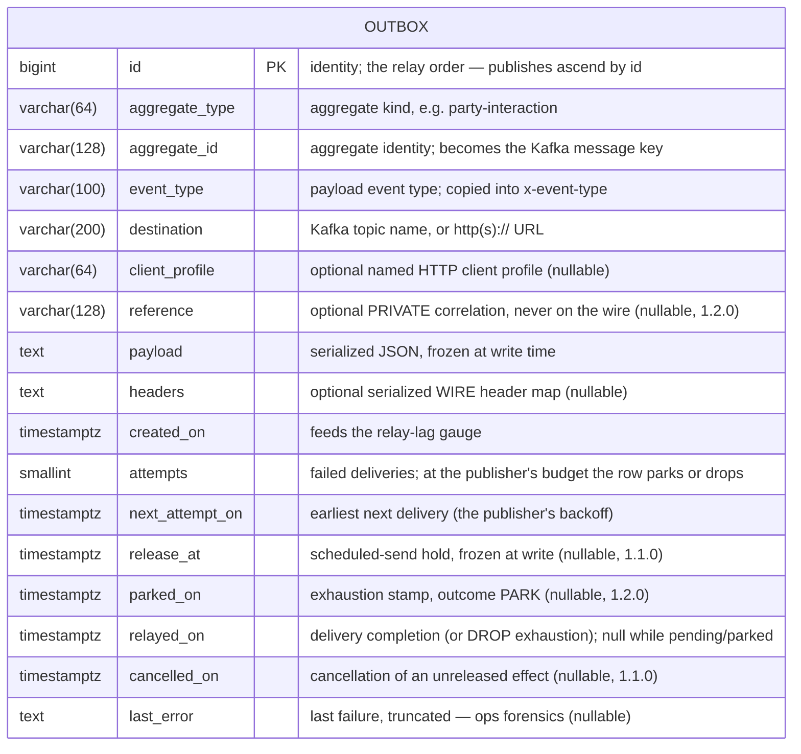
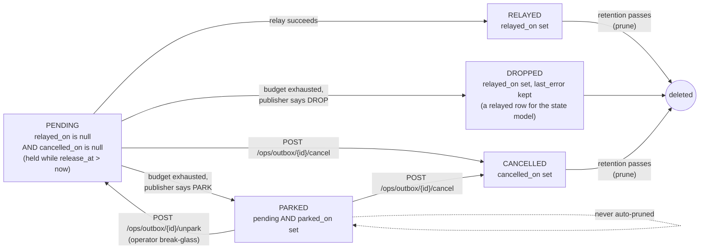
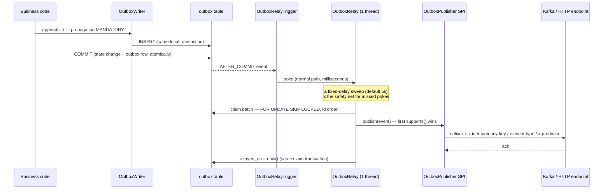

# OpenTMF Outbox Service

Transactional outbox pattern as a Spring Boot starter, using the client
application's JDBC datasource and Kafka/HTTP infrastructure.

The business transaction writes its state change AND one outbox row in the same
local transaction; an in-service relay then delivers the event at-least-once —
so "state changed AND the platform heard it" never has a crash window, in either
order. The payload is serialized at write time: the event is a fact frozen at
commit, never re-read later.

The library auto-configures itself unconditionally (there is no `DataSource`
guard — a JPA datasource is a hard requirement, and a consumer without one fails
at boot by name). The consumer supplies the datasource, the Liquibase include,
security rows for the `/ops` endpoints, and optionally its own publisher /
client-resolver / relayed-listener beans.

## Created Database Table

This library owns ONE table, created by its bundled Liquibase changelog
(consumers include the changelog by reference and never copy or edit it —
schema evolution arrives by library version bump):

| Table Name | Description                                                            |
|------------|------------------------------------------------------------------------|
| OUTBOX     | Events frozen at commit, relayed at-least-once in id order              |



State is **derived** — there is no status column to corrupt. Four legs —
pending, parked, relayed, cancelled — plus **held**, the pending sub-state
with a future `release_at`:



A pending row whose `release_at` lies in the future is **held**: it is not
claimable until that instant. The hold is frozen at write time — the retry
backoff moves `next_attempt_on` only and can never move `release_at` (the
mapping itself is `updatable = false`; a named regression test,
`backoff_neverTouchesTheReleaseHold`, guards the property). A cancelled row is
never relayed, is retained for audit, and is pruned on the same retention as
relayed rows.

A partial index (`ix_outbox_pending` on `next_attempt_on where relayed_on is
null and cancelled_on is null and parked_on is null`) keeps the relay's claim
query cheap regardless of the terminal backlog.

## How It Works



- **One relay thread per pod, id-ascending.** Ordering is a contract **at one
  replica**: rows appended in one business transaction — or for one aggregate
  in successive ones — are delivered in `id` order (the "PI before bounce"
  guarantee). **Across replicas** `FOR UPDATE SKIP LOCKED` is the guard, and it
  interleaves: two pods take disjoint rows concurrently, so strict per-key
  order across pods is not promised. A consumer needing it runs one replica or
  accepts the interleave. Each pass drains: it keeps claiming batches while
  full batches come back.
- **At-least-once, consumer-dedupable.** A crash between delivery and commit
  means redelivery; `x-idempotency-key = <spring.application.name>:outbox:<id>`
  makes consumer dedup trivial. **The key format is a cross-service contract**
  (downstream dedup tables key on it) — it never changes shape; the constants
  and the formatter are public in `OutboxHeaders`. Set
  `spring.application.name`: without it the prefix (and `x-producer`) is the
  literal `unknown`.
- **Backoff, then park — or drop — by the publisher's policy.** A failed row
  books `attempts++`, `last_error`, and the next attempt (the library's
  exponential backoff, or the publisher's own). At the budget (the library's
  `max-attempts`, or the publisher's own) the row is **exhausted**: the
  publisher's `onExhausted` says PARK (default: `parked_on` stamped, excluded
  from claims, the `parked` gauge alerts, unparking is an explicit ops action,
  never auto-pruned) or DROP (`relayed_on` stamped so the row leaves the
  pending set, `last_error` kept, the `dropped` counter books it, a WARN — no
  relayed listener fires and `relayed` is not incremented: nothing was
  delivered). A publisher throws `TerminalOutboxException` to reach exhaustion
  immediately — from `publish` only: thrown by a *listener* it is an ordinary
  retry like any listener failure. Two consequences worth knowing: a DROP
  publisher paired with a persistently failing listener ends in DROP although
  the effect itself was delivered on every attempt (the listener, not the
  delivery, kept failing — the destination saw N idempotent copies); and the
  001/002 onboarding preconditions probe `information_schema` for
  `current_schema()`, i.e. the outbox lives in the consumer's own schema.
- **Claim eligibility lives in ONE place** — the claim query:
  `relayed_on is null and cancelled_on is null and parked_on is null and
  (release_at is null or release_at <= now) and next_attempt_on <= now`, in
  `id` order (no attempt-count leg: the budget is per publisher). A held row
  waits for its hold; a cancelled or parked row never comes back on its own.
  The ops actions (`cancel`, `unpark`) read their row under a waiting
  `FOR UPDATE` **with no timeout**: one that races a claim in flight blocks for
  that one publish, then sees the row as the relay left it — a cancel that
  arrives while the relay holds the row fails with "already relayed" rather
  than silently marking a delivered effect cancelled.
- **Publisher routing.** Everything that is not an `http(s)://` URL is a Kafka
  topic (the Kafka publisher registers at lowest precedence as the default).
  HTTP destinations are POSTed the payload with the relay headers. Consumers
  may contribute their own `OutboxPublisher` beans — first `supports()` wins,
  so `@Order` a consumer publisher ahead of the defaults (e.g. an `adapter:`
  scheme). A publisher runs INSIDE the claim transaction and **may write to the
  same database there** (flow's "mark recorded"): its writes commit together
  with `relayed_on`.
- **Wire headers vs private reference.** Both built-in publishers forward
  every stored header, then stamp `x-idempotency-key`, `x-event-type` and
  `x-producer`, **replacing** a stored header of the same name (both legs,
  since 1.2.0 — HTTP used to append). The row's `reference` is private
  correlation (a subscription id, say): filterable on the ops list, visible on
  the row view, never a header.
- **Kafka specifics.** The record value is the stored JSON **string** — the
  consumer's value serializer must be string-compatible (a `JsonSerializer`
  double-encodes it). `traceparent` on the wire is Micrometer's Kafka
  observation, which the consumer enables with
  `spring.kafka.template.observation-enabled=true`; the library stamps nothing
  home-grown.

## Requirements

- Java 17+
- Spring Boot 4.1+
- A JPA datasource (PostgreSQL is the shipped DDL dialect) and Liquibase
- Kafka destinations: `spring-kafka` + `spring-boot-kafka` (both optional here)
- HTTP destinations: `spring-web` on the classpath (the HTTP publisher rides
  `RestClient`; without spring-web an `http(s)://` row is unroutable and parks)

## Supported Configuration Properties

Everything lives under the `opentmf.outbox` namespace and is optional — the
defaults below are what you get without any configuration:

```yaml
opentmf:
  outbox:
    sweep-interval: 5s       # fixed-delay relay sweep (timers are for the tail)
    batch-size: 100          # rows claimed per relay pass
    max-attempts: 10         # the LIBRARY delivery budget (a publisher may declare its own)
    backoff-base: 5s         # first retry delay
    backoff-factor: 2.0      # exponential multiplier (a double)
    backoff-cap: 10m         # delay ceiling
    retention: 7d            # relayed AND cancelled rows older than this are pruned
    send-timeout: 10s        # broker-acknowledgement wait per publish
    ops-endpoints: true      # serve the /ops surface (see below) - a conditional switch,
                             # not a field of OutboxProperties
```

| Property         | Type       | Default | Notes                                                                 |
|------------------|------------|---------|-----------------------------------------------------------------------|
| `sweep-interval` | `Duration` | `5s`    | The safety-net timer; the after-commit poke is the normal path.       |
| `batch-size`     | `int`      | `100`   | A full batch triggers an immediate follow-up claim (drain).           |
| `max-attempts`   | `int`      | `10`    | The library budget; a publisher's `maxAttempts(event)` > 0 overrides it per row. |
| `backoff-base`   | `Duration` | `5s`    | Delay after the first failure.                                        |
| `backoff-factor` | `double`   | `2.0`   | `delay = base * factor^(attempts-1)`, capped; a publisher's `backoff(event, attempt)` overrides. |
| `backoff-cap`    | `Duration` | `10m`   | Ceiling for the exponential delay.                                    |
| `retention`      | `Duration` | `7d`    | Used by the prune (`OutboxMaintenanceService.prune()`): relayed AND cancelled rows. |
| `send-timeout`   | `Duration` | `10s`   | Non-transactional Kafka sends await the ack this long.                |
| `ops-endpoints`  | `boolean`  | `true`  | `false` removes the library's `/ops` controller entirely. A `@ConditionalOnProperty` key read at boot, not a bound field. |

## Metrics

Library-stable names — one name across every consumer; the emitting service is
distinguished by the registry's common tags / scrape identity, never by a
per-service metric prefix. Without a `MeterRegistry` bean the relay still works
(a local simple registry, no exporter).

| Metric                     | Type    | Meaning                                            |
|----------------------------|---------|----------------------------------------------------|
| `opentmf.outbox.pending`   | gauge   | Rows not yet relayed nor cancelled (held and parked included) |
| `opentmf.outbox.parked`    | gauge   | Rows with `parked_on` stamped — **alert when > 0** |
| `opentmf.outbox.relay-lag` | gauge   | Seconds the oldest *released* pending row has been deliverable (a held row is not lagging) |
| `opentmf.outbox.relayed`   | counter | Successful relays, tagged by `destination`         |
| `opentmf.outbox.dropped`   | counter | Rows given up by a publisher's DROP policy, tagged by `destination` (never counted as relayed) |
| `opentmf.outbox.attempts`  | summary | Delivery attempts a relayed row took               |

## Usage

### Import opentmf-versions

```xml
<dependencyManagement>
  <dependencies>
    <dependency>
      <groupId>org.opentmf</groupId>
      <artifactId>opentmf-versions</artifactId>
      <version>RELEASE</version>
      <type>pom</type>
      <scope>import</scope>
    </dependency>
  </dependencies>
</dependencyManagement>
```

### Add Maven Dependency

```xml
<dependency>
  <groupId>org.opentmf.util</groupId>
  <artifactId>opentmf-outbox-service</artifactId>
</dependency>
```

### Include the Liquibase changelog

From your master changelog — by reference, never copied:

```xml
<include file="db/changelog/opentmf-outbox.sql" relativeToChangelogFile="false"/>
```

The changelog is ONE clean create (changeset `001-outbox`) plus additive
evolution: `002-outbox-hold-and-cancel` (1.1.0: `release_at`, `cancelled_on`)
and `003-outbox-policy-reference-onboarding` (1.2.0: `parked_on`, `reference`,
the onboarding adds below, the index recreated to the 1.2.0 predicate).

**Upgrading** needs no consumer change at any step: the included changelog
applies the missing changesets on the next start (nullable columns only, no
rewrite; the recorded checksums of 001/002 are unchanged — an IT proves the
released 1.1.0 changelog upgrades cleanly), the existing `append` overloads keep
their meaning, and existing rows are unaffected — new columns are null, so rows
stay eligible exactly as before. A row that was parked under 1.1.0 (attempts at
the old max, no `parked_on`) becomes claimable again once on 1.2.0 and, failing
again, parks with the stamp — unpark semantics are otherwise identical.

#### Adopting with an existing `outbox` table

A service that already carries a hand-written `outbox` table (its own
changesets created it) includes the library changelog **as is** — no
hand-seeding of `DATABASECHANGELOG`, no schema rebuild:

- `001-outbox` is guarded `onFail:MARK_RAN` on *the table does not exist* —
  over a pre-existing table it is marked ran and creates nothing;
- `002-…` is guarded the same way on *neither `release_at` nor `cancelled_on`
  exists*;
- `003-…` adds every library column that is missing (`add column if not
  exists`: `client_profile`, `release_at`, `cancelled_on`, `parked_on`,
  `reference`) and recreates `ix_outbox_pending` — so both a 1.0.0-shaped table
  and one that already grew its own `release_at` / `cancelled_on` arrive at the
  1.2.0 shape. This holds on a **fresh** database too, where the consumer's
  own pre-library changesets run first.

What stays the consumer's (a changeset of its own, after the include):
constraints and defaults the library does not have — in particular a
`release_at NOT NULL DEFAULT now()`: the writer sets `release_at` explicitly
(null for an ordinary append), so a column default never applies and the insert
fails until **both** the NOT NULL and the default are dropped — and columns the
library does not know, which it never drops. `OutboxOnboardingIT` runs all of
these shapes; `Profile681HubIT` boots over a 681-shaped table end to end.

### Append events

Inside your business transaction (the writer demands one — propagation
`MANDATORY`, so a dual-write can never compile into existence):

```java
// Kafka destination: any name that is not an http(s):// URL is a topic
outboxWriter.append("party-interaction", partyInteractionId,
    "comm.outcome.v1", "comm.outcome.v1", outcomeFact);

// HTTP destination — POSTed with the relay headers
outboxWriter.append("hub-subscription", subscriptionId,
    "hub.event.v1", "https://subscriber.example/callback", eventFact);

// HTTP destination through a NAMED client profile (authenticated subscriber)
outboxWriter.append("hub-subscription", subscriptionId,
    "hub.event.v1", callbackUrl, "hub-subscriber-7", eventFact, Map.of());

// Scheduled send: the request shape carries the HOLD - not deliverable before
// releaseAt (every optional selector is a wither; null hold = deliverable now)
outboxWriter.append(
    OutboxAppend.of("comm-schedule", scheduleId, "comm.send.v1", "comm.send.v1", sendFact)
        .withReleaseAt(releaseAt));

// A private correlation (never a wire header) - filter the ops list by it later
outboxWriter.append(
    OutboxAppend.of("hub-subscription", eventId, "hub.event.v1", callbackUrl, eventFact)
        .withReference(subscriptionId));
```

The hold is frozen at write time and has no reschedule API — to move a
scheduled send, cancel the row (`OutboxMaintenanceService.cancel(id)` or the
`/ops` endpoint) and append a new one. Cancelling is possible only while the
effect has not left: a relayed row refuses with an `IllegalStateException`
("already relayed"), as does an already-cancelled one.

Pass the payload as a fact object — it is serialized at write time. Extra
**wire** headers frozen at write time ride the `Map<String,String>` overload or
`withHeaders`; the relay stamps `x-idempotency-key`, `x-event-type` and
`x-producer` on top, replacing same-named stored ones on both legs. Anything
that must NOT reach the wire goes in `withReference`.

### Publisher failure policy (`OutboxPublisher`)

A consumer publisher decides its own retry budget, backoff and exhaustion
outcome — three default methods, so an existing publisher is unaffected:

```java
@Bean
@Order(Ordered.HIGHEST_PRECEDENCE)   // ahead of the library's HTTP/Kafka defaults
OutboxPublisher hubSender(RestClient hub) {
  return new OutboxPublisher() {
    public boolean supports(OutboxEvent e) { return e.getDestination().contains("/hub/"); }
    public void publish(OutboxEvent e) { /* POST, attaching OutboxHeaders.idempotencyKey(...) */ }
    public int maxAttempts(OutboxEvent e) { return 3; }                     // 0 = library max-attempts
    public Duration backoff(OutboxEvent e, int attempt) { return Duration.ofMinutes(1); } // null = library backoff
    public ExhaustionOutcome onExhausted(OutboxEvent e) { return ExhaustionOutcome.DROP; }  // default PARK
  };
}
```

The worker resolves the publisher **first**, then books every failure with that
publisher's policy. `TerminalOutboxException` from `publish` skips straight to
the exhaustion outcome (the destination said retrying is pointless); any other
`RuntimeException` is a retry. A DROP is booked as `relayed_on` + `last_error`
+ the `dropped` counter — no relayed listener fires and `relayed` is not
incremented.

### Named HTTP clients (`OutboxClientProfileResolver`)

The library deliberately does NOT depend on any HTTP-client stack beyond
Spring's `RestClient`. A consumer that needs authenticated deliveries (e.g.
TMF640 hub subscribers with OAuth) implements the resolver over its own named
clients — per-row `client_profile` first, destination base-url longest-prefix
match second, plain POST otherwise:

```java
@Bean
OutboxClientProfileResolver outboxClientProfileResolver(MyNamedClients clients) {
  return (clientProfile, destination) -> clients.byProfileOrBaseUrl(clientProfile, destination);
}
```

Returning `null` falls back to the plain default client.

### Post-relay bookkeeping (`OutboxRelayedListener`)

Consumer bookkeeping that must commit **atomically with the delivery** — e.g.
stamping a business record's state together with `relayed_on` — registers an
`OutboxRelayedListener` bean (any number; invoked in bean order):

```java
@Bean
OutboxRelayedListener recordStateStamp(RecordRepository records) {
  return event -> records.markInProgress(event.getAggregateId());
}
```

The listener runs inside the claim transaction, after the effect is delivered,
with `relayedOn` already set on the managed entity; several listeners run in
bean order. A thrown exception undoes the stamp and books an ordinary delivery
failure under the row's publisher policy — the publish then repeats, so the
destination dedups via the idempotency key as for any at-least-once redelivery
— and a listener that keeps failing exhausts the row only after that many
republishes, so make it idempotent and reliable. Listeners never fire for a
DROPPED row (nothing was delivered). Keep implementations same-database and
fast: they run on the single relay thread.

### Ops endpoints

Served under `/ops` on the main port (disable with
`opentmf.outbox.ops-endpoints=false`). The endpoints carry no security of their
own — the consumer's deny-by-default posture governs, and its security config
must gate them as admin-class (payloads and `last_error` travel on this
surface):

| Method | Path                          | What                                                                  |
|--------|-------------------------------|-----------------------------------------------------------------------|
| POST   | `/ops/outbox/maintenance/prune` | Deletes relayed + cancelled rows past retention; wire to a CronJob kicker |
| POST   | `/ops/outbox/{id}/unpark`     | Break-glass after the root cause is fixed: `parked_on` cleared, attempts reset, due now |
| POST   | `/ops/outbox/{id}/cancel`     | Withdraws an unreleased effect: never relayed, retained for audit     |
| GET    | `/ops/outbox`                 | TMF630 triage list (attribute filtering + paging), payloads omitted   |
| GET    | `/ops/outbox/state/{state}`   | The list narrowed to one derived-state leg (`pending`, `parked`, `relayed`, `cancelled`; unknown → 400), same filtering + paging on top |
| GET    | `/ops/outbox/parked`          | Runbook alias of `/ops/outbox/state/parked`                           |
| GET    | `/ops/outbox/{id}`            | One row in full — payload + `last_error`, the pre-unpark forensic read (behind the consumer's admin role, by ruling) |

One wire contract for the estate: an unknown row id answers **404**, an action
on a row not in the state it needs (cancel/unpark a relayed row, unpark a row
that is not parked) answers **409** — mapped inside the library controller, no
advice bean, so the consumer's own exception handling is untouched.

Both list endpoints render through the TMF630 toolkit (bare array + count
headers); an unknown filter field is a strict 400. The state legs on the list
are the toolkit's null-filtering over `relayedOn` / `cancelledOn` / `parkedOn`
(`reference` is filterable too); each row carries `releaseAt`, `parkedOn`,
`cancelledOn` and `reference`, and `parked` stays the one derived flag. The
derived-state legs ride the PATH (`/state/{state}`), not a `?state=` query
parameter: the toolkit's predicate resolver reads the whole parameter map and
rejects any non-reserved name before a handler runs (a `?state=` form needs a
toolkit pass-through allowance — backlog).

The `tmf630-toolkit-all` dependency is **optional, honestly**: without it on
the classpath the `/ops` controller is not registered at all (a guarded,
documented absence — never a silently degraded endpoint). A toolkit-less
consumer keeps the full `OutboxMaintenanceService` API and can wire its own
endpoints.

### Seal rule (ArchUnit)

The public contract is the `org.opentmf.outbox` package: `OutboxWriter` +
`OutboxAppend`, `OutboxMaintenanceService`, `OutboxEvent` / `OutboxRowView`,
`OutboxStateFilter`, `OutboxProperties`, `OutboxHeaders`, the SPI types
(`OutboxPublisher` + `TerminalOutboxException`, `OutboxClientProfileResolver`),
the post-relay seam `OutboxRelayedListener` and `OutboxArchRules` itself.
Everything under `org.opentmf.outbox.internal`
(relay, repository, publishers, auto-configuration, ops controller) is
implementation with no compatibility promise. One line in the consumer's
ArchUnit suite keeps business code on the contract side:

```java
@ArchTest
static final ArchRule outbox_isTouchedOnlyThroughTheSeams =
    OutboxArchRules.consumersUseOnlyTheSeams();
```

It forbids any dependency on `org.opentmf.outbox.internal..` from outside the
library, and consumer-owned Spring Data repositories over the `OutboxEvent`
entity — the one misuse the package boundary cannot see. Requires ArchUnit ≥ 1.5.0 on Java 25 bytecode (older ASM
parses nothing and the rule silently checks NOTHING).

### Testing your integration

The library is self-contained for consumer testing — no test-jar needed:

- **Unit**: mock the concrete public `OutboxWriter` and verify the
  `append(...)` call — "my business action emitted this fact" is the consumer's
  test seam; the relay machinery beyond it is the library's own tested
  responsibility.
- **Integration**: the real auto-configuration, changelog and relay run in your
  own Testcontainers IT. Seed rows (e.g. a parked one) by persisting the public
  `OutboxEvent` entity through the `EntityManager` — the ONLY seal-safe seeding
  (a consumer-owned repository over `OutboxEvent` is exactly what the seal
  rule rejects; a seeded row fires no after-commit nudge, the sweep picks it up).
  A seeded **parked** row must set `parkedOn` (since 1.2.0 attempts alone do
  not park: a row with `attempts = max-attempts` and no stamp is pending and
  claimable):

  ```java
  OutboxEvent parked = new OutboxEvent();
  parked.setAggregateType("t"); parked.setAggregateId("a"); parked.setEventType("e.v1");
  parked.setDestination("topic"); parked.setPayload("{}");
  parked.setCreatedOn(now); parked.setNextAttemptOn(now);
  parked.setAttempts(10); parked.setLastError("boom");
  parked.setParkedOn(now);            // the stamp is what makes it parked
  entityManager.persist(parked);
  ```
- **Conformance**: the library carries one IT per real consumer profile
  (`Profile681HubIT`, `ProfileFlowHttpSideEffectIT`,
  `ProfileAdapterKafkaOrderIT`) plus the crash-window, SKIP LOCKED contention
  and onboarding ITs — the contracts above are pinned there, so a consumer gap
  is a red library build, not a discovery after the cut.

### Migrating from a hand-written outbox

1. Include the library changelog **after** your own `outbox` changesets (see
   "Adopting with an existing `outbox` table" above): the library onboards the
   table in place; only your own constraints/defaults and extra columns need a
   cut-over changeset of yours. Prefer that over a schema rebuild —
   **sharp edge — the id sequence IS the idempotency key.** A schema rebuild
   restarts the identity at 1, so new rows REUSE old
   `<service>:outbox:<id>` keys — and every idempotency-disciplined consumer will
   silently drop your new events as replays (no error, no lag, no reaction). After any table
   rebuild in an environment with live consumers, restart the identity above
   the used range:
   `alter table outbox alter column id restart with <safely-high-value>;`
2. Replace your writer/relay/park classes with `OutboxWriter` + configuration.
   The idempotency-key format is `<spring.application.name>:outbox:<id>`.
3. Move dashboards and alerts to the library-stable metric names above.
4. Point ops runbooks at the `/ops` surface; direct DB reads are a
   missing-module smell.
5. Wire the seal rule into your ArchUnit suite.

## Development

Quality gates on this repo:

- JaCoCo bundle gate **90/90/90** (line/instruction/branch), unit + IT
  execution merged; generated Querydsl classes excluded from the denominator.
- SonarQube (`mvn -Psonar clean verify` against a local server on
  `localhost:9000`, token via `SONAR_TOKEN`): zero open findings is the bar.
- PIT (`mvn -Pmutation test-compile org.pitest:pitest-maven:mutationCoverage`)
  on the pinned 1.19.6 hold with incremental history (1.20+ moved free
  `withHistory` behind the commercial arcmutate plugin). No mutation threshold:
  survivor review is the unit of work.

### PIT survivor review

Run PIT locally for the current figures (the report is not committed).
Accepted survivors, each reviewed:

| Where | Mutant | Verdict |
|---|---|---|
| `OutboxMaintenanceService.prune` | `relayed + cancelled > 0` boundary/negation | Log-only guard; row deletion is unaffected |
| `OutboxRelayWorker.exhaust` | log-level legs | Log-only; the PARK/DROP outcome itself is asserted by the worker tests |
| `OutboxRelayWorker.truncate` | `<=` vs `<` boundary | Equivalent mutant at exactly 4000 chars |
| `OutboxRelay.stop` | awaitTermination conditional | Shutdown-timing leg; a kill needs a 5s hanging-task test for no insight |
| `OutboxRelay` thread factory | removed `setDaemon` | Asserted by `OutboxRelayTests` in every normal run; PIT's per-line selection misses the factory-lambda mapping |

`NO_COVERAGE` entries (auto-configuration bean methods, ops controller) are
exercised by the Testcontainers ITs, which the posture deliberately keeps out
of PIT (unit tests only).

## Version History

See [CHANGELOG.md](CHANGELOG.md) for detailed version history.
