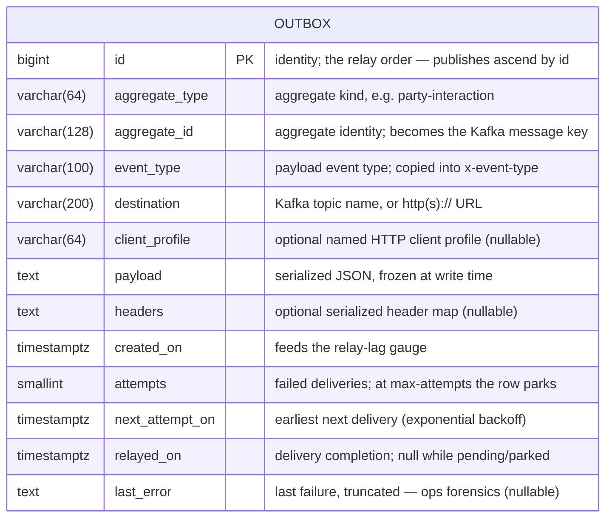
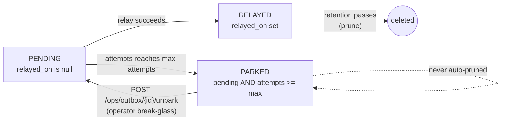
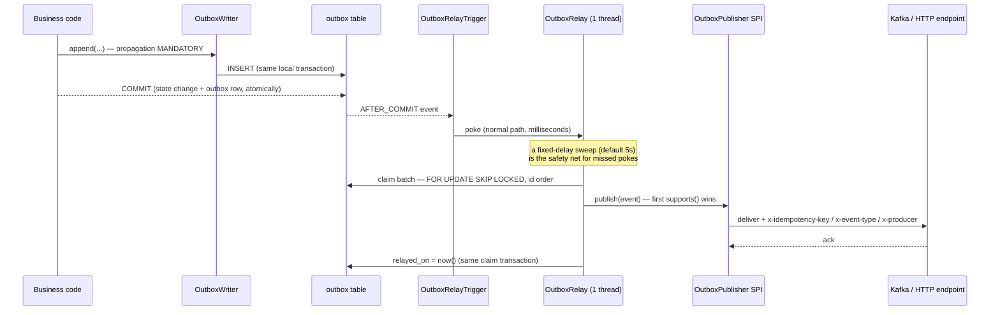

# OpenTMF Outbox Service

Transactional outbox pattern as a Spring Boot starter, using the client
application's JDBC datasource and Kafka/HTTP infrastructure.

The business transaction writes its state change AND one outbox row in the same
local transaction; an in-service relay then delivers the event at-least-once —
so "state changed AND the platform heard it" never has a crash window, in either
order. The payload is serialized at write time: the event is a fact frozen at
commit, never re-read later.

The library auto-configures itself when a JPA `DataSource` is present. The
consumer supplies the datasource, the Liquibase include, security rows for the
`/ops` endpoints, and optionally its own publisher/client-resolver beans.

## Created Database Table

This library owns ONE table, created by its bundled Liquibase changelog
(consumers include the changelog by reference and never copy or edit it —
schema evolution arrives by library version bump):

| Table Name | Description                                                            |
|------------|------------------------------------------------------------------------|
| OUTBOX     | Events frozen at commit, relayed at-least-once in id order              |



State is **derived** — there is no status column to corrupt:



A partial index (`ix_outbox_pending` on `next_attempt_on where relayed_on is
null`) keeps the relay's claim query cheap regardless of the relayed backlog.

## How It Works



- **One relay thread per pod**; `FOR UPDATE SKIP LOCKED` is the cross-pod
  guard. Each pass drains: it keeps claiming batches while full batches come
  back.
- **At-least-once, consumer-dedupable.** A crash between delivery and commit
  means redelivery; `x-idempotency-key = <spring.application.name>:outbox:<id>`
  makes consumer dedup trivial.
- **Backoff, then park.** A failed row books `attempts++`, `last_error`, and an
  exponential next attempt. At `max-attempts` the row parks: excluded from
  claims, the `parked` gauge alerts, unparking is an explicit ops action.
  Parked rows are never auto-pruned.
- **Publisher routing.** Everything that is not an `http(s)://` URL is a Kafka
  topic (the Kafka publisher registers at lowest precedence as the default).
  HTTP destinations are POSTed the payload with the relay headers. Consumers
  may contribute their own `OutboxPublisher` beans — first `supports()` wins.

## Requirements

- Java 17+
- Spring Boot 4.1+
- A JPA datasource (PostgreSQL is the shipped DDL dialect) and Liquibase
- Kafka only if Kafka destinations are used (`spring-kafka` is optional);
  nothing extra for HTTP destinations

## Supported Configuration Properties

Everything lives under the `opentmf.outbox` namespace and is optional — the
defaults below are what you get without any configuration:

```yaml
opentmf:
  outbox:
    sweep-interval: 5s       # fixed-delay relay sweep (timers are for the tail)
    batch-size: 100          # rows claimed per relay pass
    max-attempts: 10         # park threshold
    backoff-base: 5s         # first retry delay
    backoff-factor: 2        # exponential multiplier
    backoff-cap: 10m         # delay ceiling
    retention: 7d            # relayed rows older than this are pruned
    send-timeout: 10s        # broker-acknowledgement wait per publish
    ops-endpoints: true      # serve the /ops surface (see below)
```

| Property         | Type       | Default | Notes                                                                 |
|------------------|------------|---------|-----------------------------------------------------------------------|
| `sweep-interval` | `Duration` | `5s`    | The safety-net timer; the after-commit poke is the normal path.       |
| `batch-size`     | `int`      | `100`   | A full batch triggers an immediate follow-up claim (drain).           |
| `max-attempts`   | `int`      | `10`    | Also the derived-state boundary for `parked`.                         |
| `backoff-base`   | `Duration` | `5s`    | Delay after the first failure.                                        |
| `backoff-factor` | `int`      | `2`     | `delay = base * factor^(attempts-1)`, capped.                         |
| `backoff-cap`    | `Duration` | `10m`   | Ceiling for the exponential delay.                                    |
| `retention`      | `Duration` | `7d`    | Used by the prune (`OutboxMaintenanceService.pruneRelayed()`).        |
| `send-timeout`   | `Duration` | `10s`   | Non-transactional Kafka sends await the ack this long.                |
| `ops-endpoints`  | `boolean`  | `true`  | `false` removes the library's `/ops` controller entirely.             |

## Metrics

Library-stable names — one name across every consumer; the emitting service is
distinguished by the registry's common tags / scrape identity, never by a
per-service metric prefix. Without a `MeterRegistry` bean the relay still works
(a local simple registry, no exporter).

| Metric                     | Type    | Meaning                                            |
|----------------------------|---------|----------------------------------------------------|
| `opentmf.outbox.pending`   | gauge   | Rows not yet relayed                               |
| `opentmf.outbox.parked`    | gauge   | Rows parked at max-attempts — **alert when > 0**   |
| `opentmf.outbox.relay-lag` | gauge   | Age of the oldest pending row, seconds             |
| `opentmf.outbox.relayed`   | counter | Successful relays, tagged by `destination`         |
| `opentmf.outbox.attempts`  | summary | Delivery attempts a relayed row took               |

## Usage

### Import opentmf-versions

```xml
<dependencyManagement>
  <dependencies>
    <dependency>
      <groupId>org.opentmf</groupId>
      <artifactId>opentmf-versions</artifactId>
      <version>RELEASE</version>
      <type>pom</type>
      <scope>import</scope>
    </dependency>
  </dependencies>
</dependencyManagement>
```

### Add Maven Dependency

```xml
<dependency>
  <groupId>org.opentmf.util</groupId>
  <artifactId>opentmf-outbox-service</artifactId>
</dependency>
```

### Include the Liquibase changelog

From your master changelog — by reference, never copied:

```xml
<include file="db/changelog/opentmf-outbox.sql" relativeToChangelogFile="false"/>
```

The changelog is ONE clean create. A service whose environments already carry a
pre-library `outbox` table owns its own transition (rebuild the schema, or a
local one-off) — the library ships no onboarding shims.

### Append events

Inside your business transaction (the writer demands one — propagation
`MANDATORY`, so a dual-write can never compile into existence):

```java
// Kafka destination: any name that is not an http(s):// URL is a topic
outboxWriter.append("party-interaction", partyInteractionId,
    "comm.outcome.v1", "comm.outcome.v1", outcomeFact);

// HTTP destination — POSTed with the relay headers
outboxWriter.append("hub-subscription", subscriptionId,
    "hub.event.v1", "https://subscriber.example/callback", eventFact);

// HTTP destination through a NAMED client profile (authenticated subscriber)
outboxWriter.append("hub-subscription", subscriptionId,
    "hub.event.v1", callbackUrl, "hub-subscriber-7", eventFact, Map.of());
```

Pass the payload as a fact object — it is serialized at write time. Extra
headers frozen at write time ride the `Map<String,String>` overload; the relay
stamps `x-idempotency-key`, `x-event-type` and `x-producer` on top (relay wins
on name collisions).

### Named HTTP clients (`OutboxClientProfileResolver`)

The library deliberately does NOT depend on any HTTP-client stack beyond
Spring's `RestClient`. A consumer that needs authenticated deliveries (e.g.
TMF640 hub subscribers with OAuth) implements the resolver over its own named
clients — per-row `client_profile` first, destination base-url longest-prefix
match second, plain POST otherwise:

```java
@Bean
OutboxClientProfileResolver outboxClientProfileResolver(MyNamedClients clients) {
  return (clientProfile, destination) -> clients.byProfileOrBaseUrl(clientProfile, destination);
}
```

Returning `null` falls back to the plain default client.

### Ops endpoints

Served under `/ops` on the main port (disable with
`opentmf.outbox.ops-endpoints=false`). The endpoints carry no security of their
own — the consumer's deny-by-default posture governs, and its security config
must gate them as admin-class (payloads and `last_error` travel on this
surface):

| Method | Path                          | What                                                                  |
|--------|-------------------------------|-----------------------------------------------------------------------|
| POST   | `/ops/outbox/maintenance/prune` | Deletes relayed rows past retention; wire to a CronJob kicker        |
| POST   | `/ops/outbox/{id}/unpark`     | Break-glass after the root cause is fixed: attempts reset, due now    |
| GET    | `/ops/outbox`                 | TMF630 triage list (attribute filtering + paging), payloads omitted   |
| GET    | `/ops/outbox/parked`          | The derived state a wire filter cannot express (config comparison)    |
| GET    | `/ops/outbox/{id}`            | One row in full — payload + `last_error`, the pre-unpark forensic read|

Both list endpoints render through the TMF630 toolkit (bare array + count
headers); an unknown filter field is a strict 400.

### Seal rule (ArchUnit)

The public contract is the `org.opentmf.outbox` package: `OutboxWriter`,
`OutboxMaintenanceService`, `OutboxEvent` / `OutboxRowView`, `OutboxStateFilter`,
`OutboxProperties` and the SPI pair (`OutboxPublisher`,
`OutboxClientProfileResolver`). Everything under `org.opentmf.outbox.internal`
(relay, repository, publishers, auto-configuration, ops controller) is
implementation with no compatibility promise. One line in the consumer's
ArchUnit suite keeps business code on the contract side:

```java
@ArchTest
static final ArchRule outbox_isTouchedOnlyThroughTheSeams =
    OutboxArchRules.consumersUseOnlyTheSeams();
```

It forbids any dependency on `org.opentmf.outbox.internal..` from outside the
library, and consumer-owned Spring Data repositories over the `OutboxEvent`
entity — the one misuse the package boundary cannot see. Requires ArchUnit ≥ 1.5.0 on Java 25 bytecode (older ASM
parses nothing and the rule silently checks NOTHING).

### Testing your integration

The library is self-contained for consumer testing — no test-jar needed:

- **Unit**: mock the concrete public `OutboxWriter` and verify the
  `append(...)` call — "my business action emitted this fact" is the consumer's
  test seam; the relay machinery beyond it is the library's own tested
  responsibility.
- **Integration**: the real auto-configuration, changelog and relay run in your
  own Testcontainers IT. Seed rows (e.g. a parked one) by persisting the public
  `OutboxEvent` entity through the `EntityManager`.

### Migrating from a hand-written outbox

1. Include the library changelog and delete your own `outbox` changeset file —
   fold, never migrate. Environments that already ran a pre-library changeset
   are yours to transition (schema rebuild or a local one-off).
   **Sharp edge — the id sequence IS the idempotency key.** A schema rebuild
   restarts the identity at 1, so new rows REUSE old
   `<service>:outbox:<id>` keys — and every idempotency-disciplined consumer will
   silently drop your new events as replays (no error, no lag, no reaction). After any table
   rebuild in an environment with live consumers, restart the identity above
   the used range:
   `alter table outbox alter column id restart with <safely-high-value>;`
2. Replace your writer/relay/park classes with `OutboxWriter` + configuration.
   The idempotency-key format is `<spring.application.name>:outbox:<id>`.
3. Move dashboards and alerts to the library-stable metric names above.
4. Point ops runbooks at the `/ops` surface; direct DB reads are a
   missing-module smell.
5. Wire the seal rule into your ArchUnit suite.

## Development

Quality gates on this repo:

- JaCoCo bundle gate **90/90/90** (line/instruction/branch), unit + IT
  execution merged; generated Querydsl classes excluded from the denominator.
- SonarQube (`mvn -Psonar clean verify` against a local server on
  `localhost:9000`, token via `SONAR_TOKEN`): zero open findings is the bar.
- PIT (`mvn -Pmutation test-compile org.pitest:pitest-maven:mutationCoverage`)
  on the pinned 1.19.6 hold with incremental history (1.20+ moved free
  `withHistory` behind the commercial arcmutate plugin). No mutation threshold:
  survivor review is the unit of work.

### PIT survivor review (123 mutations, 97 killed)

Accepted survivors, each reviewed:

| Where | Mutant | Verdict |
|---|---|---|
| `OutboxMaintenanceService.pruneRelayed` | `pruned > 0` boundary/negation | Log-only guard; row deletion is unaffected |
| `OutboxRelayWorker.registerFailure` | `attempts >= max` boundary/negation | Log-level-only; parked state is *derived* from attempts, not this branch |
| `OutboxRelayWorker.truncate` | `<=` vs `<` boundary | Equivalent mutant at exactly 4000 chars |
| `OutboxRelay.stop` | awaitTermination conditional | Shutdown-timing leg; a kill needs a 5s hanging-task test for no insight |
| `OutboxRelay` thread factory | removed `setDaemon` | Asserted by `OutboxRelayTests` in every normal run; PIT's per-line selection misses the factory-lambda mapping |

`NO_COVERAGE` entries (auto-configuration bean methods, ops controller) are
exercised by the Testcontainers ITs, which the posture deliberately keeps out
of PIT (unit tests only).

## Version History

See [CHANGELOG.md](CHANGELOG.md) for detailed version history.
