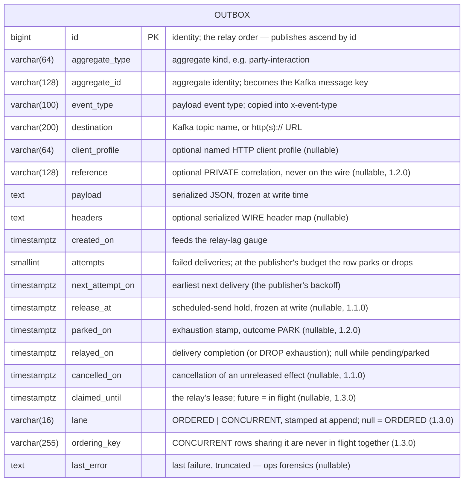
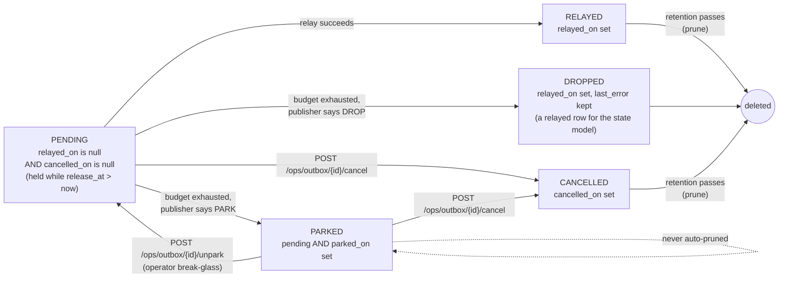
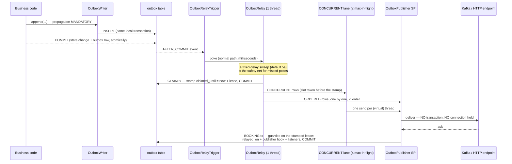

# OpenTMF Outbox Service

Transactional outbox pattern as a Spring Boot starter, using the client
application's JDBC datasource and Kafka/HTTP infrastructure.

The business transaction writes its state change AND one outbox row in the same
local transaction; an in-service relay then delivers the event at-least-once —
so "state changed AND the platform heard it" never has a crash window, in either
order. The payload is serialized at write time: the event is a fact frozen at
commit, never re-read later.

The library auto-configures itself unconditionally (there is no `DataSource`
guard — a JPA datasource is a hard requirement, and a consumer without one fails
at boot by name). The consumer supplies the datasource, the Liquibase include,
security rows for the `/ops` endpoints, and optionally its own publisher /
client-resolver / relayed-listener beans.

## Created Database Table

This library owns ONE table, created by its bundled Liquibase changelog
(consumers include the changelog by reference and never copy or edit it —
schema evolution arrives by library version bump):

| Table Name | Description                                                            |
|------------|------------------------------------------------------------------------|
| OUTBOX     | Events frozen at commit, relayed at-least-once, claimed by lease        |


```mermaid
erDiagram
    OUTBOX {
        bigint      id              PK "identity; the relay order — publishes ascend by id"
        varchar(64) aggregate_type     "aggregate kind, e.g. party-interaction"
        varchar(128) aggregate_id      "aggregate identity; becomes the Kafka message key"
        varchar(100) event_type        "payload event type; copied into x-event-type"
        varchar(200) destination       "Kafka topic name, or http(s):// URL"
        varchar(64) client_profile     "optional named HTTP client profile (nullable)"
        varchar(128) reference         "optional PRIVATE correlation, never on the wire (nullable, 1.2.0)"
        text        payload            "serialized JSON, frozen at write time"
        text        headers            "optional serialized WIRE header map (nullable)"
        timestamptz created_on         "feeds the relay-lag gauge"
        smallint    attempts           "failed deliveries; at the publisher's budget the row parks or drops"
        timestamptz next_attempt_on    "earliest next delivery (the publisher's backoff)"
        timestamptz release_at         "scheduled-send hold, frozen at write (nullable, 1.1.0)"
        timestamptz parked_on          "exhaustion stamp, outcome PARK (nullable, 1.2.0)"
        timestamptz relayed_on         "delivery completion (or DROP exhaustion); null while pending/parked"
        timestamptz cancelled_on       "cancellation of an unreleased effect (nullable, 1.1.0)"
        timestamptz claimed_until      "the relay's lease; future = in flight (nullable, 1.3.0)"
        varchar(16) lane               "ORDERED | CONCURRENT, stamped at append; null = ORDERED (1.3.0)"
        varchar(255) ordering_key      "CONCURRENT rows sharing it are never in flight together (1.3.0)"
        text        last_error         "last failure, truncated — ops forensics (nullable)"
    }
```

State is **derived** — there is no status column to corrupt. Four legs —
pending, parked, relayed, cancelled — plus two pending sub-states: **held**
(a future `release_at`) and **in flight** (a future `claimed_until`: a relay
holds the row's lease and its send is not booked yet, 1.3.0):


```mermaid
flowchart LR
    P["PENDING\nrelayed_on is null\nAND cancelled_on is null\n(held while release_at > now)"] -->|"relay succeeds"| R["RELAYED\nrelayed_on set"]
    P -->|"budget exhausted,\npublisher says PARK"| K["PARKED\npending AND parked_on set"]
    P -->|"budget exhausted,\npublisher says DROP"| D["DROPPED\nrelayed_on set, last_error kept\n(a relayed row for the state model)"]
    K -->|"POST /ops/outbox/{id}/unpark\n(operator break-glass)"| P
    P -->|"POST /ops/outbox/{id}/cancel"| C["CANCELLED\ncancelled_on set"]
    K -->|"POST /ops/outbox/{id}/cancel"| C
    R -->|"retention passes\n(prune)"| G(("deleted"))
    D --> G
    C -->|"retention passes\n(prune)"| G
    K -.->|"never auto-pruned"| K
```

A pending row whose `release_at` lies in the future is **held**: it is not
claimable until that instant. The hold is frozen at write time — the retry
backoff moves `next_attempt_on` only and can never move `release_at` (the
mapping itself is `updatable = false`; a named regression test,
`backoff_neverTouchesTheReleaseHold`, guards the property). A cancelled row is
never relayed, is retained for audit, and is pruned on the same retention as
relayed rows.

A partial index (`ix_outbox_pending` on `next_attempt_on where relayed_on is
null and cancelled_on is null and parked_on is null`) keeps the relay's claim
query cheap regardless of the terminal backlog; a second one
(`ix_outbox_claimed_until`, over leased pending rows, 1.3.0) backs the
in-flight gauge.

`relayed` and `cancelled` overlap in exactly one case: a row cancelled while
its send was in flight, whose send then succeeded — booked
**sent-but-cancelled**, both stamps set, listed under both states (see the
lease below).

## How It Works


```mermaid
sequenceDiagram
    participant B as Business code
    participant W as OutboxWriter
    participant DB as outbox table
    participant T as OutboxRelayTrigger
    participant R as OutboxRelay (1 thread)
    participant L as CONCURRENT lane (≤ max-in-flight)
    participant Pub as OutboxPublisher SPI
    participant K as Kafka / HTTP endpoint

    B->>W: append(...) — propagation MANDATORY
    W->>DB: INSERT (same local transaction)
    B-->>DB: COMMIT (state change + outbox row, atomically)
    DB-->>T: AFTER_COMMIT event
    T->>R: poke (normal path, milliseconds)
    Note over R: a fixed-delay sweep (default 5s)<br/>is the safety net for missed pokes
    R->>DB: CLAIM tx — stamp claimed_until = now + lease, COMMIT
    R->>L: CONCURRENT rows (slot taken before the stamp)
    R->>Pub: ORDERED rows, one by one, id order
    L->>Pub: one send per (virtual) thread
    Pub->>K: deliver — NO transaction, NO connection held
    K-->>Pub: ack
    Pub->>DB: BOOKING tx — guarded on the stamped lease:<br/>relayed_on + publisher hook + listeners, COMMIT
```

- **Two lanes, chosen by the publisher (1.3.0) AT APPEND.** `OutboxPublisher.lane(event)`
  is `ORDERED` (the default) or `CONCURRENT`. The writer asks the row's
  publisher (through the relay's own router) and stamps `lane` and
  `ordering_key` on the row, **frozen like the headers**. The stamped lane
  wins at claim time even if the publisher would now say otherwise, so
  changing a publisher's lane affects only rows appended afterwards. A row
  not written through `OutboxWriter` (a raw SQL insert, migrated data, a row
  from before 1.3.0) has no lane and rides ORDERED. An append never fails on
  this account: a row no publisher supports, or whose publisher throws while
  naming its lane, is stored without one and the relay books it as before.
  The **ORDERED** lane is the single relay thread per pod: rows go one by one
  in `id` order — the 1.2.x behaviour; the Kafka publisher rides it. The **CONCURRENT** lane sends rows
  in parallel, one per thread, at most `concurrent.max-in-flight` (default 8)
  at a time; the HTTP publisher rides it, so a slow subscriber never delays a
  Kafka row again. CONCURRENT rows keep **no order** against ORDERED rows, nor
  against CONCURRENT rows with another **ordering key**. Rows sharing a key
  are never in flight together and go in `id` order on the happy path (a
  failed row backs off, and later rows of its key may pass it). The HTTP
  publisher's key is the destination, so rows to one receiver keep their order.
  A key over 255 characters is stored as `sha256:<hex>`. **Each lane claims
  over its own query and index**, so no backlog of one lane can hide a row of
  the other: an ORDERED row relays within seconds behind 1,500 pending rows of
  one slow subscriber (`OutboxBacklogIT`).
- **Claimed by lease, not by a lock held across the send.** A short claim
  transaction stamps `claimed_until = now + lease` on the rows it takes and
  commits. The send runs in **no transaction and holds no database
  connection**. A short booking transaction then writes the outcome, guarded
  on `id = ? and claimed_until = <the value this holder stamped>`. If the lease
  lapsed (the call outlived it, or the pod died) any relay may claim the row
  again, and the late holder books nothing. **A publisher's lease must exceed
  its longest call** (`lease(event)`, or the lane default:
  `opentmf.outbox.lease` 2 min for CONCURRENT, `opentmf.outbox.ordered.lease`
  15 s for ORDERED, which must exceed `send-timeout`). Each ORDERED row's lease
  is renewed in the booking of the row before it, so it covers one send, never
  the batch.
- **The CONCURRENT claim takes only free slots.** The slot (permit) is taken by
  the claim before it stamps a row, never inside the send task, so no lease
  burns while a row waits in a queue. On a JDK 21+ runtime with
  `spring.threads.virtual.enabled=true` the sends run on virtual threads. Any
  other runtime uses platform threads, and that fallback is safe only because
  of this ordering: Spring's `SimpleAsyncTaskExecutor` starts one thread per
  task, so `max-in-flight` is also the thread bound. The library's bytecode
  stays on Java 17.
- **Ordering at one replica** therefore means: ORDERED rows in `id` order,
  CONCURRENT rows in `id` order per ordering key. **Across replicas**
  `FOR UPDATE SKIP LOCKED` plus the lease is the guard: two pods never take
  one row twice. A row another pod is claiming is skipped, and once that claim
  commits the row carries a live lease. Pods still interleave ORDERED rows, so
  strict order across pods is not promised. Rows of one ordering key are
  **never in flight together within a pod**. Across pods the one exception is
  a backed-off row that comes due during another pod's claim of a later row of
  its key; order for that key was already given up when the row failed.
- **At-least-once, consumer-dedupable.** A crash between delivery and booking
  means redelivery once the row's lease lapses (seconds on the ORDERED lane,
  up to the lease on the CONCURRENT lane); `x-idempotency-key = <spring.application.name>:outbox:<id>`
  makes consumer dedup trivial. **The key format is a cross-service contract**
  (downstream dedup tables key on it) — it never changes shape; the constants
  and the formatter are public in `OutboxHeaders`. Set
  `spring.application.name`: without it the prefix (and `x-producer`) is the
  literal `unknown`.
- **Backoff, then park — or drop — by the publisher's policy.** A failed row
  books `attempts++`, `last_error`, and the next attempt (the library's
  exponential backoff, or the publisher's own). At the budget (the library's
  `max-attempts`, or the publisher's own) the row is **exhausted**: the
  publisher's `onExhausted` says PARK (default: `parked_on` stamped, excluded
  from claims, the `parked` gauge alerts, unparking is an explicit ops action,
  never auto-pruned) or DROP (`relayed_on` stamped so the row leaves the
  pending set, `last_error` kept, the `dropped` counter books it, a WARN — no
  relayed listener fires and `relayed` is not incremented: nothing was
  delivered). A publisher throws `TerminalOutboxException` to reach exhaustion
  immediately — from `publish` only: thrown by a *listener* it is an ordinary
  retry like any listener failure. Two consequences worth knowing: a DROP
  publisher paired with a persistently failing listener ends in DROP although
  the effect itself was delivered on every attempt (the listener, not the
  delivery, kept failing — the destination saw N idempotent copies); and the
  001/002 onboarding preconditions probe `information_schema` for
  `current_schema()`, i.e. the outbox lives in the consumer's own schema.
- **Claim eligibility lives in ONE place**, the two lane claims (one
  repository, side by side):
  `relayed_on is null and cancelled_on is null and parked_on is null and
  (release_at is null or release_at <= now) and next_attempt_on <= now and
  (claimed_until is null or claimed_until <= now)`, in `id` order, `FOR UPDATE
  SKIP LOCKED` (no attempt-count leg: the budget is per publisher). The
  ORDERED claim adds `lane is null or lane <> 'CONCURRENT'`. The CONCURRENT
  claim adds `lane = 'CONCURRENT'` and, for a keyed row, the ordering-key
  rule: no row of its key with a lower id is due, and no row of its key at all
  is in flight. A row in backoff lets later rows of its key pass. A held row
  waits for its hold; a cancelled or parked row never comes back on its own.
- **The claim moves `next_attempt_on` to the lease end**, and every booking
  sets it again: the publisher's backoff on a failure, the booking time
  otherwise. Two consequences. A **pre-1.3.0 relay**, which knows no lease,
  sees a leased row as not due and leaves it alone during a rolling upgrade.
  The row view's `nextAttemptOn` of an in-flight row reads as its lease end.
  The retry schedule is still computed from `attempts`, and `release_at` is
  never touched.
- **Ops actions against a row in flight.** `cancel` and `unpark` read their row
  under a waiting `FOR UPDATE`. Since 1.3.0 that serialises only against the
  short claim and booking transactions, never against a send (the claims skip
  a row an ops action holds). A **cancel of a
  row in flight succeeds at once**, and the booking honours it. A send that
  then fails retires the row cancelled (no retry, no park; the booking hook
  sees `CANCELLED`). A send that succeeds is booked **sent-but-cancelled**:
  both stamps, listed under relayed and cancelled, the relayed listeners fire
  because the effect did leave, and a WARN names it. An ORDERED row cancelled
  before its turn is released unsent. An `unpark` never meets a live lease:
  only a booking parks a row, and that booking clears the lease.
- **Shutdown.** The relay stops claiming, gives the sends in flight
  `shutdown-grace` (default 10 s) to finish and book, and abandons the rest:
  they book nothing, and their rows are redelivered once their leases lapse.
- **Publisher routing.** Everything that is not an `http(s)://` URL is a Kafka
  topic (the Kafka publisher registers at lowest precedence as the default).
  HTTP destinations are POSTed the payload with the relay headers. Consumers
  may contribute their own `OutboxPublisher` beans — first `supports()` wins,
  so `@Order` a consumer publisher ahead of the defaults (e.g. an `adapter:`
  scheme). A consumer without Kafka on the classpath gets the HTTP publisher
  only; nothing Kafka-typed is linked (and a web-less consumer, conversely,
  gets only the Kafka one). **A publisher's own database write** (flow's "mark
  recorded", 681's subscription suspension) belongs in its **booking hook**
  `onBooked(event, booking)`. The hook runs inside the booking transaction for
  every outcome (`RELAYED` with `deliver`'s result, `RETRY`, `EXHAUSTED`,
  `CANCELLED` with the failure), so the write commits and rolls back with the
  row's bookkeeping. Until 1.2.x such a write lived in `publish`, inside the
  claim transaction. Since 1.3.0 `publish` runs in no transaction.
- **Wire headers vs private reference.** Both built-in publishers forward
  every stored header, then stamp `x-idempotency-key`, `x-event-type` and
  `x-producer`, **replacing** a stored header of the same name (both legs,
  since 1.2.0 — HTTP used to append). The row's `reference` is private
  correlation (a subscription id, say): filterable on the ops list, visible on
  the row view, never a header.
- **Kafka specifics.** The record value is the stored JSON **string** — the
  consumer's value serializer must be string-compatible (a `JsonSerializer`
  double-encodes it). `traceparent` on the wire is Micrometer's Kafka
  observation, which the consumer enables with
  `spring.kafka.template.observation-enabled=true`; the library stamps nothing
  home-grown.

## Requirements

- Java 17+ (Java 21+ with `spring.threads.virtual.enabled=true` puts the
  CONCURRENT lane on virtual threads; platform threads otherwise)
- Spring Boot 4.1+
- A JPA datasource (PostgreSQL is the shipped DDL dialect) and Liquibase
- Kafka destinations: `spring-kafka` + `spring-boot-kafka` (both optional here)
- HTTP destinations: `spring-web` on the classpath (the HTTP publisher rides
  `RestClient`; without spring-web an `http(s)://` row is unroutable and parks)

## Supported Configuration Properties

Everything lives under the `opentmf.outbox` namespace and is optional — the
defaults below are what you get without any configuration:

```yaml
opentmf:
  outbox:
    sweep-interval: 5s       # fixed-delay relay sweep (timers are for the tail)
    batch-size: 100          # rows claimed per relay pass
    max-attempts: 10         # the LIBRARY delivery budget (a publisher may declare its own)
    backoff-base: 5s         # first retry delay
    backoff-factor: 2.0      # exponential multiplier (a double)
    backoff-cap: 10m         # delay ceiling
    retention: 7d            # relayed AND cancelled rows older than this are pruned
    send-timeout: 10s        # broker-acknowledgement wait per publish
    lease: 2m                # CONCURRENT lane default lease (> the longest call)
    shutdown-grace: 10s      # how long a stopping relay lets sends in flight finish
    ordered:
      lease: 15s             # ORDERED lane default lease - short, > send-timeout
    concurrent:
      max-in-flight: 8       # CONCURRENT sends at once per pod (also the thread bound)
    ops-endpoints: true      # serve the /ops surface (see below) - a conditional switch,
                             # not a field of OutboxProperties
```

| Property         | Type       | Default | Notes                                                                 |
|------------------|------------|---------|-----------------------------------------------------------------------|
| `sweep-interval` | `Duration` | `5s`    | The safety-net timer; the after-commit poke is the normal path.       |
| `batch-size`     | `int`      | `100`   | A full batch triggers an immediate follow-up claim (drain).           |
| `max-attempts`   | `int`      | `10`    | The library budget; a publisher's `maxAttempts(event)` > 0 overrides it per row. |
| `backoff-base`   | `Duration` | `5s`    | Delay after the first failure.                                        |
| `backoff-factor` | `double`   | `2.0`   | `delay = base * factor^(attempts-1)`, capped; a publisher's `backoff(event, attempt)` overrides. |
| `backoff-cap`    | `Duration` | `10m`   | Ceiling for the exponential delay.                                    |
| `retention`      | `Duration` | `7d`    | Used by the prune (`OutboxMaintenanceService.prune()`): relayed AND cancelled rows. |
| `send-timeout`   | `Duration` | `10s`   | Non-transactional Kafka sends await the ack this long.                |
| `lease`          | `Duration` | `2m`    | Lease of a CONCURRENT row when its publisher declares none; must exceed the lane's longest call. |
| `ordered.lease`  | `Duration` | `15s`   | Lease of an ORDERED row when its publisher declares none. Short on purpose: after a pod stop the row waits this long. Must exceed `send-timeout` (validated at boot). |
| `concurrent.max-in-flight` | `int` | `8` | CONCURRENT sends in flight per pod; the claim takes no more rows than free slots. |
| `shutdown-grace` | `Duration` | `10s`   | On stop: the relay thread's and the in-flight sends' time to finish; the rest lapse by lease. |
| `ops-endpoints`  | `boolean`  | `true`  | `false` removes the library's `/ops` controller entirely. A `@ConditionalOnProperty` key read at boot, not a bound field. |

## Metrics

Library-stable names — one name across every consumer; the emitting service is
distinguished by the registry's common tags / scrape identity, never by a
per-service metric prefix. Without a `MeterRegistry` bean the relay still works
(a local simple registry, no exporter).

| Metric                     | Type    | Meaning                                            |
|----------------------------|---------|----------------------------------------------------|
| `opentmf.outbox.pending`   | gauge   | Rows not yet relayed nor cancelled (held, parked and in-flight included) |
| `opentmf.outbox.in-flight` | gauge   | Pending rows under a live lease, across pods — claimed, send not booked yet (1.3.0) |
| `opentmf.outbox.parked`    | gauge   | Rows with `parked_on` stamped — **alert when > 0** |
| `opentmf.outbox.relay-lag` | gauge   | Seconds the oldest *released* pending row has been deliverable (a held row is not lagging) |
| `opentmf.outbox.relayed`   | counter | Successful relays, tagged by `destination`         |
| `opentmf.outbox.dropped`   | counter | Rows given up by a publisher's DROP policy, tagged by `destination` (never counted as relayed) |
| `opentmf.outbox.attempts`  | summary | Delivery attempts a relayed row took               |

## Usage

### Import opentmf-versions

```xml
<dependencyManagement>
  <dependencies>
    <dependency>
      <groupId>org.opentmf</groupId>
      <artifactId>opentmf-versions</artifactId>
      <version>RELEASE</version>
      <type>pom</type>
      <scope>import</scope>
    </dependency>
  </dependencies>
</dependencyManagement>
```

### Add Maven Dependency

```xml
<dependency>
  <groupId>org.opentmf.util</groupId>
  <artifactId>opentmf-outbox-service</artifactId>
</dependency>
```

### Include the Liquibase changelog

From your master changelog — by reference, never copied:

```xml
<include file="db/changelog/opentmf-outbox.sql" relativeToChangelogFile="false"/>
```

The changelog is ONE clean create (changeset `001-outbox`) plus additive
evolution: `002-outbox-hold-and-cancel` (1.1.0: `release_at`, `cancelled_on`)
and `003-outbox-policy-reference-onboarding` (1.2.0: `parked_on`, `reference`,
the onboarding adds below, the index recreated to the 1.2.0 predicate).

**Upgrading** needs no consumer change at any step: the included changelog
applies the missing changesets on the next start (nullable columns only, no
rewrite; the recorded checksums of 001/002 are unchanged — an IT proves the
released 1.1.0 changelog upgrades cleanly), the existing `append` overloads keep
their meaning, and existing rows are unaffected — new columns are null, so rows
stay eligible exactly as before. A row that was parked under 1.1.0 (attempts at
the old max, no `parked_on`) becomes claimable again once on 1.2.0 and, failing
again, parks with the stamp — unpark semantics are otherwise identical.

#### Adopting with an existing `outbox` table

A service that already carries a hand-written `outbox` table (its own
changesets created it) includes the library changelog **as is** — no
hand-seeding of `DATABASECHANGELOG`, no schema rebuild:

- `001-outbox` is guarded `onFail:MARK_RAN` on *the table does not exist* —
  over a pre-existing table it is marked ran and creates nothing;
- `002-…` is guarded the same way on *neither `release_at` nor `cancelled_on`
  exists*;
- `003-…` adds every library column that is missing (`add column if not
  exists`: `client_profile`, `release_at`, `cancelled_on`, `parked_on`,
  `reference`) and recreates `ix_outbox_pending` — so both a 1.0.0-shaped table
  and one that already grew its own `release_at` / `cancelled_on` arrive at the
  1.2.0 shape. This holds on a **fresh** database too, where the consumer's
  own pre-library changesets run first.

What stays the consumer's (a changeset of its own, after the include):
constraints and defaults the library does not have — in particular a
`release_at NOT NULL DEFAULT now()`: the writer sets `release_at` explicitly
(null for an ordinary append), so a column default never applies and the insert
fails until **both** the NOT NULL and the default are dropped — and columns the
library does not know, which it never drops. `OutboxOnboardingIT` runs all of
these shapes; `Profile681HubIT` boots over a 681-shaped table end to end.

### Append events

Inside your business transaction (the writer demands one — propagation
`MANDATORY`, so a dual-write can never compile into existence):

```java
// Kafka destination: any name that is not an http(s):// URL is a topic
outboxWriter.append("party-interaction", partyInteractionId,
    "comm.outcome.v1", "comm.outcome.v1", outcomeFact);

// HTTP destination — POSTed with the relay headers
outboxWriter.append("hub-subscription", subscriptionId,
    "hub.event.v1", "https://subscriber.example/callback", eventFact);

// HTTP destination through a NAMED client profile (authenticated subscriber)
outboxWriter.append("hub-subscription", subscriptionId,
    "hub.event.v1", callbackUrl, "hub-subscriber-7", eventFact, Map.of());

// Scheduled send: the request shape carries the HOLD - not deliverable before
// releaseAt (every optional selector is a wither; null hold = deliverable now)
outboxWriter.append(
    OutboxAppend.of("comm-schedule", scheduleId, "comm.send.v1", "comm.send.v1", sendFact)
        .withReleaseAt(releaseAt));

// A private correlation (never a wire header) - filter the ops list by it later
outboxWriter.append(
    OutboxAppend.of("hub-subscription", eventId, "hub.event.v1", callbackUrl, eventFact)
        .withReference(subscriptionId));
```

The hold is frozen at write time and has no reschedule API — to move a
scheduled send, cancel the row (`OutboxMaintenanceService.cancel(id)` or the
`/ops` endpoint) and append a new one. Cancelling is possible only while the
effect has not left: a relayed row refuses with an `IllegalStateException`
("already relayed"), as does an already-cancelled one.

Pass the payload as a fact object — it is serialized at write time. Extra
**wire** headers frozen at write time ride the `Map<String,String>` overload or
`withHeaders`; the relay stamps `x-idempotency-key`, `x-event-type` and
`x-producer` on top, replacing same-named stored ones on both legs. Anything
that must NOT reach the wire goes in `withReference`.

### Publisher failure policy (`OutboxPublisher`)

A consumer publisher decides its own retry budget, backoff and exhaustion
outcome — three default methods, so an existing publisher is unaffected:

```java
@Bean
@Order(Ordered.HIGHEST_PRECEDENCE)   // ahead of the library's HTTP/Kafka defaults
OutboxPublisher hubSender(RestClient hub) {
  return new OutboxPublisher() {
    public boolean supports(OutboxEvent e) { return e.getDestination().contains("/hub/"); }
    public void publish(OutboxEvent e) { /* POST, attaching OutboxHeaders.idempotencyKey(...) */ }
    public int maxAttempts(OutboxEvent e) { return 3; }                     // 0 = library max-attempts
    public Duration backoff(OutboxEvent e, int attempt) { return Duration.ofMinutes(1); } // null = library backoff
    public ExhaustionOutcome onExhausted(OutboxEvent e) { return ExhaustionOutcome.DROP; }  // default PARK
  };
}
```

The worker resolves the publisher **first**, then books every failure with that
publisher's policy. `TerminalOutboxException` from `publish` skips straight to
the exhaustion outcome (the destination said retrying is pointless); any other
`RuntimeException` is a retry. A DROP is booked as `relayed_on` + `last_error`
+ the `dropped` counter — no relayed listener fires and `relayed` is not
incremented.

### Lanes, lease and the booking hook (`OutboxPublisher`, 1.3.0)

Five more default methods. Leave them all alone and a publisher stays on the
ORDERED lane exactly as in 1.2.x, except for where a database write must live
(below):

```java
return new OutboxPublisher() {
  public boolean supports(OutboxEvent e) { return e.getDestination().startsWith("hub:"); }
  public void publish(OutboxEvent e) { deliver(e); }
  public Lane lane(OutboxEvent e) { return Lane.CONCURRENT; }          // default ORDERED
  public String orderingKey(OutboxEvent e) { return e.getDestination(); } // null = independent
  public Duration lease(OutboxEvent e) { return Duration.ofSeconds(30); } // > the longest call; null = lane default
  public Object deliver(OutboxEvent e) { return hub.post(e); }         // runs in NO transaction
  public void onBooked(OutboxEvent e, OutboxBooking b) {              // runs IN the booking transaction
    if (b.outcome() == OutboxBooking.Outcome.EXHAUSTED) subscriptions.suspend(e.getReference());
  }
};
```

- `deliver` is the relay's entry point. By default it calls `publish` and
  returns `null`; override it when the booking needs something from the
  answer (an id the receiver assigned).
- `onBooked` sees **every** booked attempt: `RELAYED` (with `deliver`'s
  result), `RETRY`, `EXHAUSTED` (with `PARK`/`DROP`) and `CANCELLED`, each
  with its failure. It runs inside the booking transaction, after the row's
  own bookkeeping and before the relayed listeners. Its writes commit with
  that bookkeeping and roll back with it. When it throws, the booking rolls
  back. A refused `RELAYED` booking is then booked as an ordinary failure, and
  the hook sees that outcome too. A refused failure booking books nothing, and
  the row is redelivered once its lease lapses.
- A publisher that wrote to the database inside `publish` (1.1.0's documented
  contract) must move the write into `onBooked`. In `publish` it would now
  commit on its own, or fail for want of a transaction.

### Named HTTP clients (`OutboxClientProfileResolver`)

The library deliberately does NOT depend on any HTTP-client stack beyond
Spring's `RestClient`. A consumer that needs authenticated deliveries (e.g.
TMF640 hub subscribers with OAuth) implements the resolver over its own named
clients — per-row `client_profile` first, destination base-url longest-prefix
match second, plain POST otherwise:

```java
@Bean
OutboxClientProfileResolver outboxClientProfileResolver(MyNamedClients clients) {
  return (clientProfile, destination) -> clients.byProfileOrBaseUrl(clientProfile, destination);
}
```

Returning `null` falls back to the plain default client.

### Post-relay bookkeeping (`OutboxRelayedListener`)

Consumer bookkeeping that must commit **atomically with the delivery** — e.g.
stamping a business record's state together with `relayed_on` — registers an
`OutboxRelayedListener` bean (any number; invoked in bean order):

```java
@Bean
OutboxRelayedListener recordStateStamp(RecordRepository records) {
  return event -> records.markInProgress(event.getAggregateId());
}
```

The listener runs **inside the transaction that stamps `relayed_on`**, on both
lanes. Since 1.3.0 that is the short booking transaction, after the
publisher's `onBooked` hook, with `relayedOn` already set on the managed
entity; several listeners run in bean order. A thrown exception rolls the
booking back (the stamp and every hook and listener write go with it) and
books an ordinary delivery failure under the row's publisher policy — the publish then repeats, so the
destination dedups via the idempotency key as for any at-least-once redelivery
— and a listener that keeps failing exhausts the row only after that many
republishes, so make it idempotent and reliable. Listeners never fire for a
DROPPED row (nothing was delivered); they DO fire for a sent-but-cancelled
row (the effect left). Keep implementations same-database and fast: the
booking holds the row lock while they run.

### Ops endpoints

Served under `/ops` on the main port (disable with
`opentmf.outbox.ops-endpoints=false`). The endpoints carry no security of their
own — the consumer's deny-by-default posture governs, and its security config
must gate them as admin-class (payloads and `last_error` travel on this
surface):

| Method | Path                          | What                                                                  |
|--------|-------------------------------|-----------------------------------------------------------------------|
| POST   | `/ops/outbox/maintenance/prune` | Deletes relayed + cancelled rows past retention; wire to a CronJob kicker |
| POST   | `/ops/outbox/{id}/unpark`     | Break-glass after the root cause is fixed: `parked_on` cleared, attempts reset, due now |
| POST   | `/ops/outbox/{id}/cancel`     | Withdraws an unreleased effect: never relayed, retained for audit     |
| GET    | `/ops/outbox`                 | TMF630 triage list (attribute filtering + paging), payloads omitted   |
| GET    | `/ops/outbox/state/{state}`   | The list narrowed to one derived-state leg (`pending`, `parked`, `relayed`, `cancelled`; unknown → 400), same filtering + paging on top |
| GET    | `/ops/outbox/parked`          | Runbook alias of `/ops/outbox/state/parked`                           |
| GET    | `/ops/outbox/{id}`            | One row in full — payload + `last_error`, the pre-unpark forensic read (behind the consumer's admin role, by ruling) |

One wire contract for the estate: an unknown row id answers **404**, an action
on a row not in the state it needs (cancel/unpark a relayed row, unpark a row
that is not parked) answers **409** — mapped inside the library controller, no
advice bean, so the consumer's own exception handling is untouched.

Both list endpoints render through the TMF630 toolkit (bare array + count
headers); an unknown filter field is a strict 400. The state legs on the list
are the toolkit's null-filtering over `relayedOn` / `cancelledOn` / `parkedOn`
(`reference` is filterable too); each row carries `releaseAt`, `parkedOn`,
`cancelledOn` and `reference`, and `parked` stays the one derived flag. The
derived-state legs ride the PATH (`/state/{state}`), not a `?state=` query
parameter: the toolkit's predicate resolver reads the whole parameter map and
rejects any non-reserved name before a handler runs (a `?state=` form needs a
toolkit pass-through allowance — backlog).

The `tmf630-toolkit-all` dependency is **optional, honestly**: without it on
the classpath the `/ops` controller is not registered at all (a guarded,
documented absence — never a silently degraded endpoint). A toolkit-less
consumer keeps the full `OutboxMaintenanceService` API and can wire its own
endpoints.

### Seal rule (ArchUnit)

The public contract is the `org.opentmf.outbox` package: `OutboxWriter` +
`OutboxAppend`, `OutboxMaintenanceService`, `OutboxEvent` / `OutboxRowView`,
`OutboxStateFilter`, `OutboxProperties`, `OutboxHeaders`, the SPI types
(`OutboxPublisher` + `TerminalOutboxException`, `OutboxClientProfileResolver`),
the post-relay seam `OutboxRelayedListener` and `OutboxArchRules` itself.
Everything under `org.opentmf.outbox.internal`
(relay, repository, publishers, auto-configuration, ops controller) is
implementation with no compatibility promise. One line in the consumer's
ArchUnit suite keeps business code on the contract side:

```java
@ArchTest
static final ArchRule outbox_isTouchedOnlyThroughTheSeams =
    OutboxArchRules.consumersUseOnlyTheSeams();
```

It forbids any dependency on `org.opentmf.outbox.internal..` from outside the
library, and consumer-owned Spring Data repositories over the `OutboxEvent`
entity — the one misuse the package boundary cannot see. Requires ArchUnit ≥ 1.5.0 on Java 25 bytecode (older ASM
parses nothing and the rule silently checks NOTHING).

### Testing your integration

The library is self-contained for consumer testing — no test-jar needed:

- **Unit**: mock the concrete public `OutboxWriter` and verify the
  `append(...)` call — "my business action emitted this fact" is the consumer's
  test seam; the relay machinery beyond it is the library's own tested
  responsibility.
- **Integration**: the real auto-configuration, changelog and relay run in your
  own Testcontainers IT. Seed rows (e.g. a parked one) by persisting the public
  `OutboxEvent` entity through the `EntityManager` — the ONLY seal-safe seeding
  (a consumer-owned repository over `OutboxEvent` is exactly what the seal
  rule rejects; a seeded row fires no after-commit nudge, the sweep picks it up).
  A seeded **parked** row must set `parkedOn` (since 1.2.0 attempts alone do
  not park: a row with `attempts = max-attempts` and no stamp is pending and
  claimable):

  ```java
  OutboxEvent parked = new OutboxEvent();
  parked.setAggregateType("t"); parked.setAggregateId("a"); parked.setEventType("e.v1");
  parked.setDestination("topic"); parked.setPayload("{}");
  parked.setCreatedOn(now); parked.setNextAttemptOn(now);
  parked.setAttempts(10); parked.setLastError("boom");
  parked.setParkedOn(now);            // the stamp is what makes it parked
  entityManager.persist(parked);
  ```
- **Conformance**: the library carries one IT per real consumer profile
  (`Profile681HubIT`, `ProfileFlowHttpSideEffectIT`,
  `ProfileAdapterKafkaOrderIT`) plus the crash-window, SKIP LOCKED contention,
  lease, lane, backlog and onboarding ITs — the contracts above are pinned there, so a consumer gap
  is a red library build, not a discovery after the cut.

### Upgrading to 1.3.0

1. Take the version. Changeset `004-outbox-claim-lease` adds three nullable
   columns (`claimed_until`, `lane`, `ordering_key`) and three partial indexes
   (`if not exists`, so it applies to a library-created table and to an
   onboarded pre-library one alike). Rows pending at the upgrade have no lane
   and ride ORDERED once, including any pending HTTP backlog, which drains on
   the relay thread as it would have under 1.2.x.
2. **Rolling deploys are safe for sends.** A 1.3.0 claim moves
   `next_attempt_on` to the lease end, so a 1.2.x pod still running sees a
   leased row as not due and never sends it twice. While old and new pods
   overlap, **per-key order is not guaranteed**: an old pod knows no ordering
   key.
3. **A publisher that writes to the database inside `publish`** moves that
   write into `onBooked(event, booking)`. This is the one stated contract that
   changes: `publish` runs in no transaction now.
4. **Order changes for HTTP rows.** The library HTTP publisher is CONCURRENT:
   an HTTP row no longer keeps `id` order against Kafka (ORDERED) rows, nor
   against HTTP rows to other receivers. Rows to one receiver still go in
   order on the happy path. A flow that relied on "the Kafka row before the
   HTTP row" through the relay must get that order elsewhere, or ride its own
   ORDERED publisher.
5. A consumer's own publisher stays ORDERED unless it says otherwise. Moving it
   to CONCURRENT means declaring `lane`, usually an `orderingKey`, and a
   `lease` longer than its longest call. Rows it appended before the change
   keep the lane they were stamped with.
6. Ops: a cancel of a row in flight succeeds at once (it used to wait for the
   send and then refuse). Watch the new `opentmf.outbox.in-flight` gauge and
   the `inFlight` / `claimedUntil` fields on the row view. A crash after a send
   redelivers once the lease lapses, not on the next pass.

Kafka-only consumers change nothing but the version.

### Migrating from a hand-written outbox

1. Include the library changelog **after** your own `outbox` changesets (see
   "Adopting with an existing `outbox` table" above): the library onboards the
   table in place; only your own constraints/defaults and extra columns need a
   cut-over changeset of yours. Prefer that over a schema rebuild —
   **sharp edge — the id sequence IS the idempotency key.** A schema rebuild
   restarts the identity at 1, so new rows REUSE old
   `<service>:outbox:<id>` keys — and every idempotency-disciplined consumer will
   silently drop your new events as replays (no error, no lag, no reaction). After any table
   rebuild in an environment with live consumers, restart the identity above
   the used range:
   `alter table outbox alter column id restart with <safely-high-value>;`
2. Replace your writer/relay/park classes with `OutboxWriter` + configuration.
   The idempotency-key format is `<spring.application.name>:outbox:<id>`.
3. Move dashboards and alerts to the library-stable metric names above.
4. Point ops runbooks at the `/ops` surface; direct DB reads are a
   missing-module smell.
5. Wire the seal rule into your ArchUnit suite.

## Development

Quality gates on this repo:

- JaCoCo bundle gate **90/90/90** (line/instruction/branch), unit + IT
  execution merged; generated Querydsl classes excluded from the denominator.
- SonarQube (`mvn -Psonar clean verify` against a local server on
  `localhost:9000`, token via `SONAR_TOKEN`): zero open findings is the bar.
- **Prerequisite: a JDK 21+ Maven toolchain.** The ITs run twice over the
  lane: on the build JDK (17, platform threads), and `OutboxHttpLaneVirtualIT`
  in failsafe's `virtual-threads-it` execution, forked on a JDK 21+ toolchain
  for virtual threads. Without a matching entry in `~/.m2/toolchains.xml`, the
  build **fails** there instead of quietly testing one executor. A minimal
  file (paths are examples):

  ```xml
  <toolchains>
    <toolchain>
      <type>jdk</type>
      <provides><version>17</version></provides>
      <configuration><jdkHome>/usr/lib/jvm/openjdk-17</jdkHome></configuration>
    </toolchain>
    <toolchain>
      <type>jdk</type>
      <provides><version>25</version></provides>
      <configuration><jdkHome>/usr/lib/jvm/openjdk-25</jdkHome></configuration>
    </toolchain>
  </toolchains>
  ```
- **CI runs no build.** The repository has no CI workflows; the SonarCloud
  check on a pull request is SonarCloud's automatic analysis, which compiles
  and tests nothing. The gate above (unit tests, both IT executions, JaCoCo,
  local SonarQube) is run locally before every merge and cut.
- PIT (`mvn -Pmutation test-compile org.pitest:pitest-maven:mutationCoverage`)
  on the pinned 1.19.6 hold with incremental history (1.20+ moved free
  `withHistory` behind the commercial arcmutate plugin). No mutation threshold:
  survivor review is the unit of work.

### PIT survivor review

Run PIT locally for the current figures (the report is not committed).
Accepted survivors, each reviewed:

| Where | Mutant | Verdict |
|---|---|---|
| `OutboxMaintenanceService.prune` | `relayed + cancelled > 0` boundary/negation/subtraction | Log-only guard; row deletion is unaffected |
| `OutboxRelayWorker.truncate` | `<=` vs `<` boundary | Equivalent mutant at exactly 4000 chars |
| `OutboxRelayWorker.relayBatch` | negated `!lane.submit(...)` | Log-only: the refused send's permit and lease are handled inside `submit` |
| `OutboxRelayWorker.bookRelayed` / `bookFailure` | removed `logLapsed`; negated cancelled check before the WARN | Log-only; the lapse and sent-but-cancelled outcomes are asserted by the worker tests and `OutboxLeaseIT` |
| `OutboxLaneStamper.stamp` | removed `setOrderingKey(null)` in the failure path | Equivalent: the key is never set before the throw it recovers from |
| `OutboxConcurrentLane` | removed `setVirtualThreads`; `isVirtual` → false | Equivalent on the JDK 17 unit-test run; `OutboxHttpLaneVirtualIT` (JDK 21+) asserts the virtual threads, and PIT runs unit tests only |
| `OutboxRelay.stop` | awaitTermination conditional | Shutdown-timing leg; a kill needs a grace-long hanging-task test for no insight |
| `OutboxRelay.poke` | removed `passQueued.set(false)` after a rejection | Reachable only after shutdown, when no further pass can run anyway |
| `OutboxRelay` thread factory | removed `setDaemon` | Asserted by `OutboxRelayTests` in every normal run; PIT's per-line selection misses the factory-lambda mapping |

`NO_COVERAGE` entries (the Kafka publisher bean method, ops controller) are
exercised by the Testcontainers ITs, which the posture deliberately keeps out
of PIT (unit tests only); the other auto-configuration bean methods are
covered by `KafkaLessStartupTests` since 1.2.1.

## Version History

See [CHANGELOG.md](CHANGELOG.md) for detailed version history.
